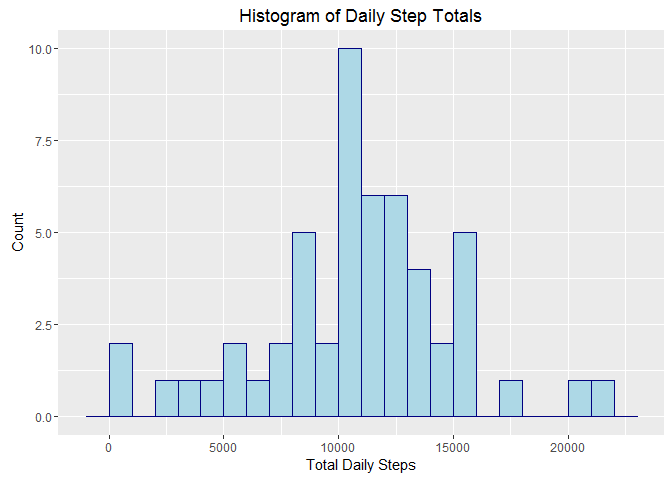
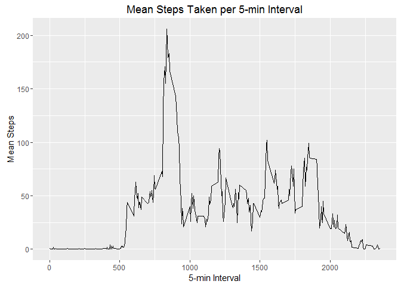
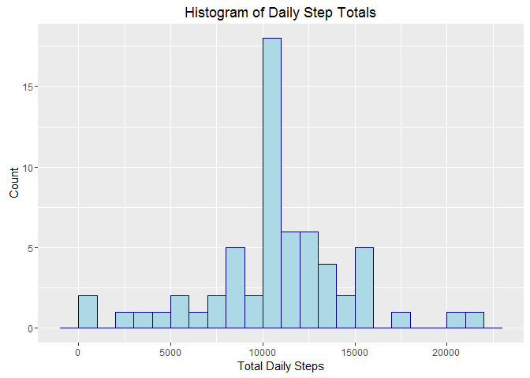
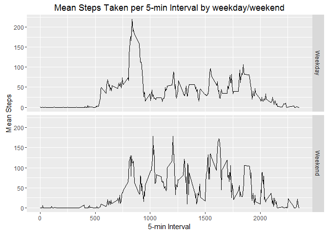

# Reproducible Research: Peer Assessment 1

This assignment makes use of data from an activity monitoring device which collects data on the number of steps taken at 5 minute intervals through out the day for one individual over a two month period in October and November, 2012.


```r
## set options
library(knitr)
suppressWarnings(library(ggplot2))
library(ggplot2)
opts_chunk$set(echo = TRUE)
```

### Loading and preprocessing the data

1. Unzip and read in the "activity.csv" data file: 


```r
## unzip data file
unzip ("activity.zip")

## read in activity.csv data file
activityData <- read.csv("activity.csv")
```

2. Process the data

```r
## data is already clean, change name of interval column to fivemininterval
names(activityData)[3] <- paste("fivemininterval")
```

### What is mean total number of steps taken per day?

1. Histogram of the total number of steps taken each day:


```r
## calculate the total number of steps by date
dailySteps <- aggregate(steps ~ date, activityData, sum)

## histogram of total steps per day
ggplot(dailySteps, aes(steps)) + 
        geom_histogram(col = "navyblue", 
                       fill = "lightblue", 
                       binwidth = 1000) + 
        labs(title = "Histogram of Daily Step Totals", 
             x = "Total Daily Steps", 
             y = "Count")
```

\

2. Calculate the mean and median of the total number of steps taken per day:


```r
## mean number of steps taken each day
meanSteps <- as.integer(mean(dailySteps$steps))

## median number of steps taken each day
medianSteps <- median(dailySteps$steps)
```

The mean number of steps taken each day is **10766**. The median number of steps taken each day is **10765**. 


### What is the average daily activity pattern?

1. Time series plot of the average number of steps taken (y-axis) per 5-minute interval (x-axis), averaged across all days :


```r
## calculate the mean number of steps taken per 5-min interval
dailyActivity <- aggregate(steps ~ fivemininterval, activityData, mean)

## name the mean steps column "stepmean"
names(dailyActivity)[2] <- paste("stepsmean")

## make the stepmean amounts of class integer
dailyActivity$stepsmean <- as.integer(dailyActivity$stepsmean)

## time series plot
ggplot(dailyActivity, aes(x = fivemininterval, y = stepsmean)) + 
        geom_line() + 
        labs(title = "Mean Steps Taken per 5-min Interval", 
             x = "5-min Interval",
             y = "Mean Steps")
```

\

2. Calculate which 5-minute interval, on average across all the days in the dataset, contains the maximum number of steps:


```r
## location of row with max step value
maxSteps <- which(dailyActivity$steps == max(dailyActivity$steps))

## return interval corresponding to max step
maxInterval <- dailyActivity[maxSteps, 1]
```

The interval with the maximum number of steps is **835**


### Imputing missing values

1. Calculate and total number of missing values in the dataset:


```r
## amount of NA's in dataset
totalNA <- sum(is.na(activityData))
```

The total number of missing values is **2304**

2. Strategy for filling in the missing values:

To fill in the missing values, replace each NA with the mean steps of the corresponding 5-min interval. 


```r
## merge original data frame with mean number of steps taken per 5-min interval
mergedData <- merge(activityData, dailyActivity, by.x = "fivemininterval")

## replace NA's with mean number of steps taken in the 5-min interval
for (i in which(is.na(mergedData$steps))) {
        mergedData$steps[i] <- mergedData$stepsmean[i]
}
```

3. Create a new dataset that is equal to the original dataset but with the missing data filled in:


```r
## sort the merged data by date then 5-min interval
mergedData <- mergedData[order(mergedData$date, mergedData$fivemininterval), ]

## subset the steps, date, and fivemininterval columns
completeData <- mergedData[ , c(2,3,1)]
```

4. Make a histogram of the total number of steps taken each day, and calculate the mean and median:


```r
## calculate the total number of steps by date in the new data frame
newDailySteps <- aggregate(steps ~ date, completeData, sum)

## plot new histogram
ggplot(newDailySteps, aes(steps)) + 
        geom_histogram(col = "navyblue", 
                       fill = "lightblue", 
                       binwidth = 1000) + 
        labs(title = "Histogram of Daily Step Totals", 
             x = "Total Daily Steps", 
             y = "Count")
```

\

```r
## calculate new mean number of steps taken each day
newMeanSteps <- as.integer(mean(newDailySteps$steps))

## calculate new median number of steps taken each day
newMedianSteps <- median(newDailySteps$steps)
```

The new mean number of steps taken per day is **10749**.The new median number of steps taken per day is **10641**. The new mean and median number of steps have decrease from the original mean **10766** and median **10765** by **17**  steps for the mean and **124** steps for the median. Imputing the NAs have caused the mean and median number of steps to decrease. 


### Are there differences in activity patterns between weekdays and weekends?

1. Create a new factor variable in the dataset with two levels -- "weekday" and "weekend":


```r
## new column dayofweek calculate which day of the week the date falls on for each row
completeData$dayofweek <- (weekdays(as.Date(completeData$date)))

## new column daytype calculate if the date is a weekday or weekend
completeData$daytype <- completeData$dayofweek
for (i in 1:17568) {
        if (completeData$dayofweek[i] == "Saturday") {
                completeData$daytype[i] <- paste("Weekend")
        }
        if (completeData$dayofweek[i] == "Sunday") {
                completeData$daytype[i] <- paste("Weekend")
        }
        else{
                completeData$daytype[i] <- paste("Weekday")
        }
}

## set daytype column as a factor with two levels - weekday and weekend 
completeData$daytype <- as.factor(completeData$daytype)
```

2. Panel plot containing a time series plot of the average number of steps taken (y axis) per 5-minute interval (x axis), averaged across all weekday days or weekend days .


```r
## calculate the mean number of steps per 5-min interval and daytype (weekday/weekend)
newDailyActivity <- aggregate(steps ~ fivemininterval + daytype, completeData, mean)

## name step mean column stepsmean
names(newDailyActivity)[3] <- paste("stepsmean")

## make the stepmean amounts of class integer
newDailyActivity$stepsmean <- as.integer(newDailyActivity$stepsmean)

## panel plot of mean steps taken per 5-min interval by daytype
ggplot(newDailyActivity, aes(x = fivemininterval, y = stepsmean)) + 
        facet_grid(daytype ~ .) +
        geom_line() + 
        labs(title = "Mean Steps Taken per 5-min Interval by weekday/weekend", 
             x = "5-min Interval",
             y = "Mean Steps")
```

\


